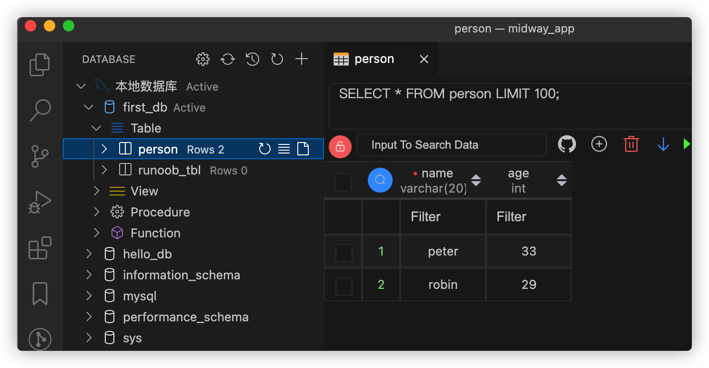

## MidWay应用
> 官网链接：http://www.midwayjs.org/doc/guide
### 1、安装和启动
```
npm init midway --type=web my_midway_app (个人电脑npm版本v6)
npm run dev
```
### 2、数据库连接
#### 2.1、本地创建数据库表  

#### 2.2、Midway数据库组件
+ 安装orm组件
+ ...各种配置

#### 2.3、数据的增删改查
