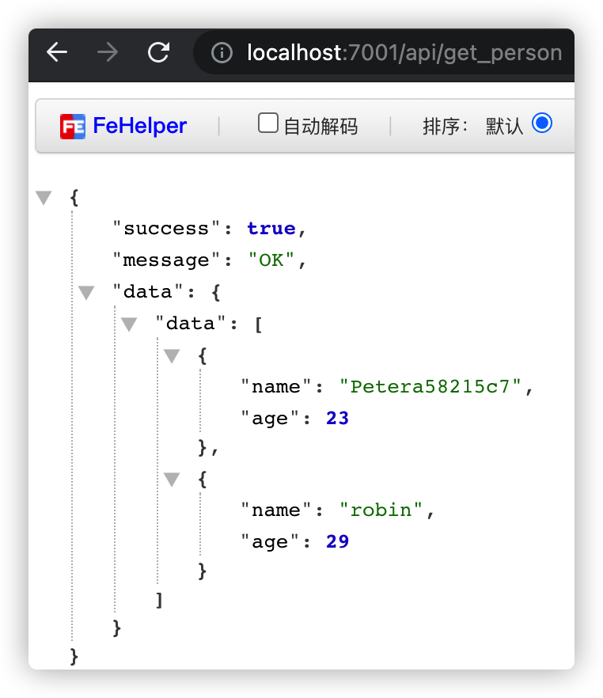

## MidWay应用
> 官网链接：http://www.midwayjs.org/doc/guide
### 1、安装和启动
```
npm init midway --type=web my_midway_app (个人电脑npm版本v6)
npm run dev
```
### 2、数据库连接
#### 2.1、本地创建数据库表  

#### 2.2、Midway数据库组件
+ 安装orm组件
+ ...各种配置

#### 2.3、数据的增删改查
```
import { Provide } from '@midwayjs/decorator';
import { IUserOptions } from '../interface';
import { Person } from '../entity/person';
import { InjectEntityModel } from '@midwayjs/orm';
import { Repository } from 'typeorm';
@Provide()
export class PersonService {
  // 注入数据库表的实例
  @InjectEntityModel(Person)
  personModel: Repository<Person>;
  // 1、查询
  async getPerson(options: IUserOptions) {
    let allPersons = await this.personModel.find();
    return {
      uid: options.uid,
      data: allPersons,
    };
  }
  // 2、增加
  async addPerson(options: IUserOptions) {
    let person = new Person();
    person.name = 'Peter' + Math.random().toString(16).slice(5);
    person.age = 23;
    const personResult = await this.personModel.save(person);
    return {
      uid: options.uid,
      data: personResult,
    };
  }
  // 3、更新
  async updatePerson(options: IUserOptions) {
    let person = await this.personModel.findOne({name:'peter'});
    person.age += 1;
    const personResult = await this.personModel.save(person);
    return {
      uid: options.uid,
      data: personResult,
    };
  }
  //4、删除
  async deletePerson(options: IUserOptions) {
    let person = await this.personModel.findOne({name:'peter'});
    const personResult = await this.personModel.remove(person);
    return {
      uid: options.uid,
      data: personResult,
    };
  }
}
```
